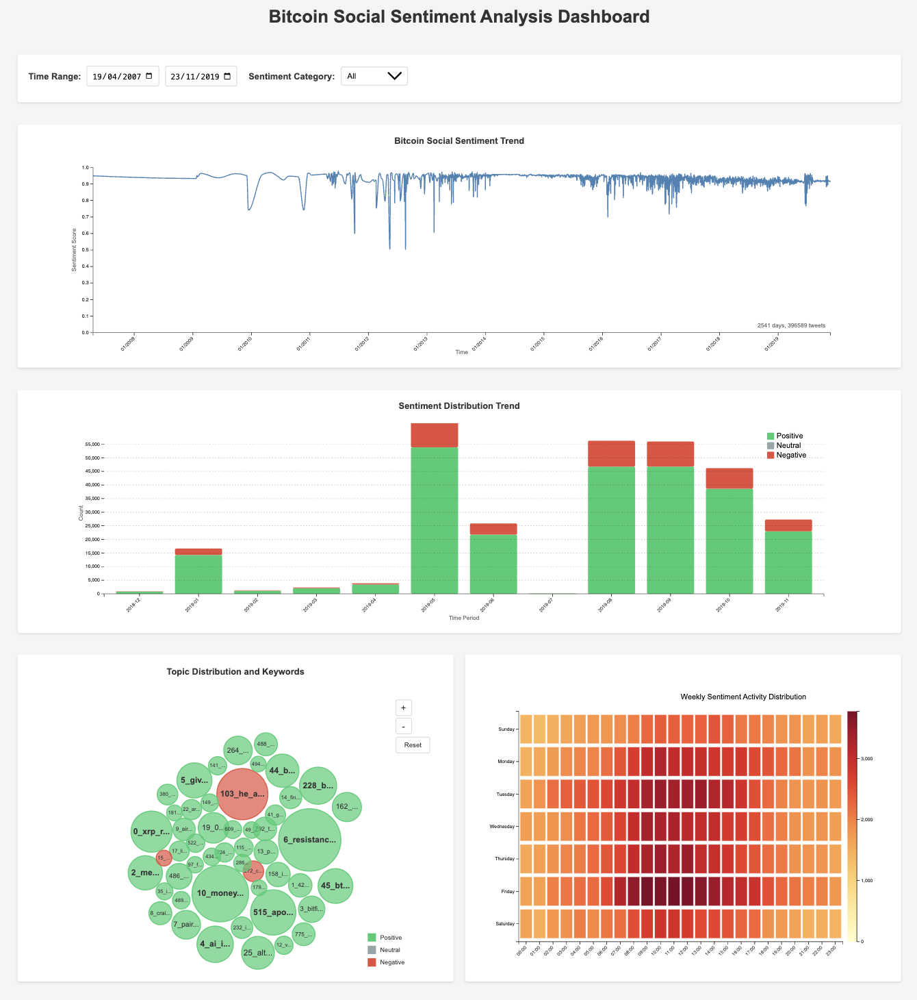
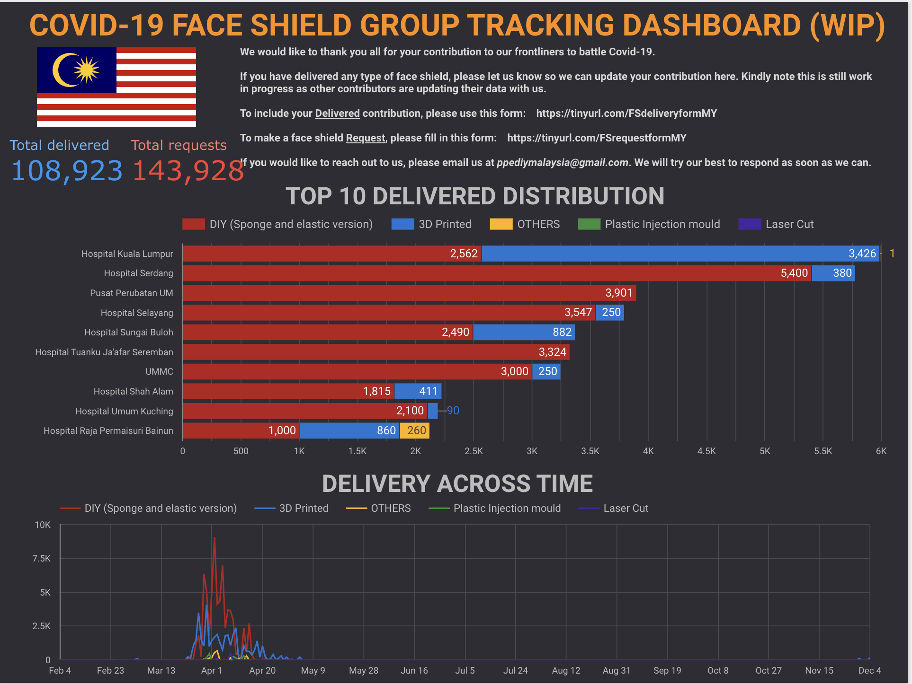
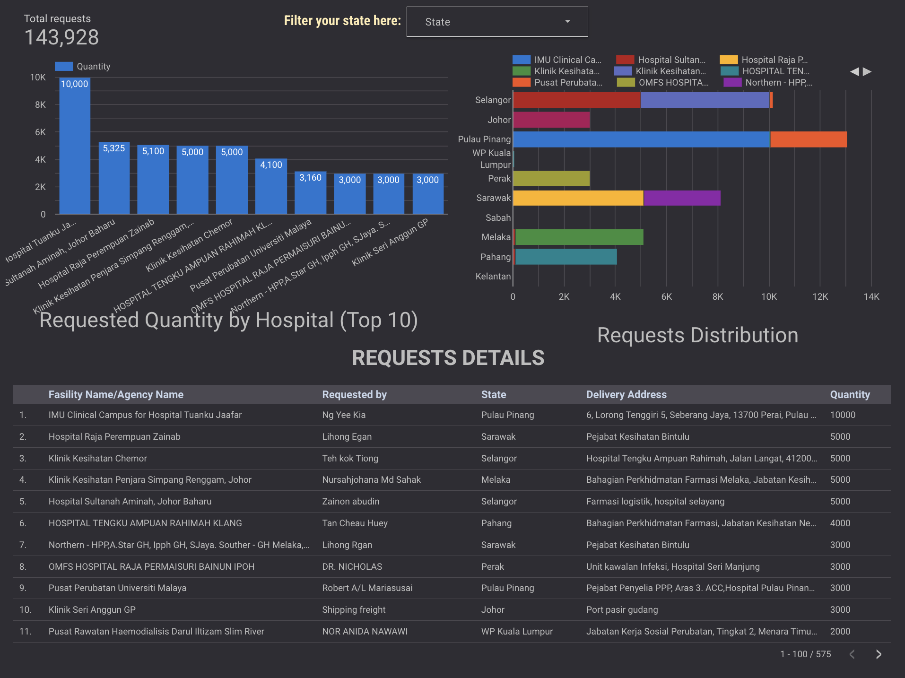
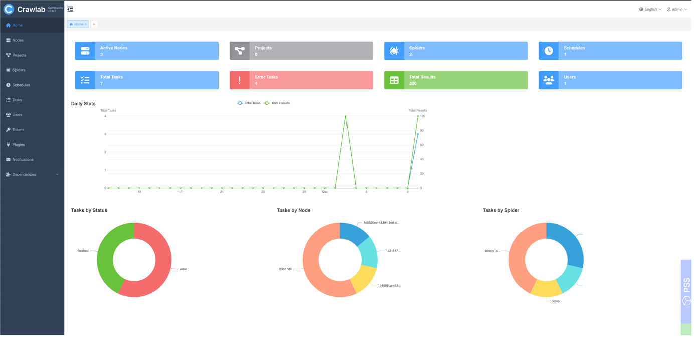

## Projects & Technical Experience

My projects are driven by a passion for extracting meaningful insights from diverse data sources, with a particular focus on Natural Language Processing, social media analytics, and the application of multimodal learning. I categorize my work into several key pillars that reflect these interests:

* **[NLP for Social & Textual Insights](#nlp--social-media-analytics-dashboards):** Developing solutions to understand and process human language. My work on the **Social Analytics Dashboard for Bitcoin Discussions** exemplifies this, where we applied advanced sentiment analysis (CryptoBERT) and topic modeling (BERTopic with Llama) to decipher trends in social media.
* **[Multimodal Machine Learning & AI Solutions](#multimodal-machine-learning--ai-solutions):** Building AI systems that integrate and interpret information from multiple modalities (e.g., text and images). My project on **Multimodal Harmful Content Detection** is a key example, focusing on developing models to align visual and textual data for identifying subtle, context-sensitive harmful content. This expertise in building and fine-tuning multimodal models was also applicable to the classification of vast amounts of e-commerce product listings at Shopee using models like ALBEF and CLIP.
* **[Blockchain & Smart Contracts](#blockchain--smart-contracts):** Exploring the practical application of data science and smart contracts in emerging ecosystems, including payment systems and trend analysis in the dApp space.
* **[Dashboards & Visualizations](#dashboards--visualizations):** Creating tools that translate complex data into actionable insights.
* **[Platform & Data Engineering](#platform--data-engineering):** Deploying and managing robust infrastructure for data collection and processing.

These pillars often intersect, reflecting my approach to leveraging diverse techniques to solve complex problems, especially those involving text data from social and online platforms.

---

### NLP & Social Media Analytics Dashboards

* **Multilingual Machine Translation System**
    * **Objective:** Developed a robust machine translation model capable of handling multiple target languages efficiently.
    * **Key Contributions & Methods:**
        * Incorporated advanced tokenization techniques, including language-specific tokenization and padding strategies.
        * Implemented custom data augmentation strategies to improve model generalization.
        * Optimized the model architecture and inference for efficient multi-target language translation.
    * **Technologies/Frameworks:** Python, Meta's [NLLB (No Language Left Behind)](https://ai.meta.com/research/no-language-left-behind/) framework.

* **Social Media Hot Topic Discovery for dApps**
    * **Objective:** To identify trending projects and hot topics within the decentralized application (dApp) and DeFi space by analyzing social media and dApp data.
    * **Key Contributions & Methods:**
        * Developed a data pipeline for scraping dApp data from sources like [DeFi Llama](https://defillama.com/) and [DappRadar](https://dappradar.com/).
        * Created ETL scripts for data extraction, transformation, and loading.
        * Implemented data analysis functions to calculate statistics and identify trends in the blockchain ecosystem.
        * Leveraged the ChatGPT API to analyze tweets from crypto experts for identifying trending projects.
    * **Technologies/Tools:** Python, Web Scraping libraries, ETL processes, ChatGPT API, Data Analysis libraries (e.g., Pandas, NumPy).

* **E-commerce Product Listings Classification (Shopee)**
    * **Objective:** To accurately classify vast amounts of product listings into appropriate categories, enhancing user experience and streamlining platform operations.
    * **Key Contributions & Methods:**
        * Fine-tuned multimodal models (ALBEF and CLIP) for joint text-image understanding.
        * Fine-tuned text-based models (CNN, BERT, fastText) for semantic understanding of product descriptions.
    * **Technologies/Tools:** Python, ALBEF, CLIP, CNN, BERT, fastText, PyTorch/TensorFlow.

### Multimodal Machine Learning & AI Solutions

* **[Multimodal Harmful Content Detection]()**
    * **Objective:** To detect harmful content in multimodal datasets (text and images), focusing on aligning textual and visual data to capture context-sensitive relationships.
    * **Key Contributions & Methods:**
        * Integrated advanced NLP and computer vision techniques for cohesive multimodal analysis.
        * Addressed the challenge of aligning text and image data to understand nuanced and subtle harmful content.
    * **Technologies/Tools:** python, PyTorch, CLIP, Hugging Face Transformers.
    * **Code:** [HatefulMeme Challenge GitHub Repository](https://github.com/lowweihong/meme-challenge)

* **Automated ID Card Classification & Verification System**
    * **Objective:** Developed an automated system for Optical Character Recognition (OCR) and face detection from ID documents to streamline classification and validation.
    * **Key Contributions & Methods:**
        * Utilized PaddleOCR and EasyOCR for robust text extraction and face detection.
        * Integrated the system with Kafka for efficient asynchronous message handling and processing of ID documents.
        * Implemented utility functions and deployment scripts to streamline the document verification workflow.
    * **Technologies/Tools:** Python, PaddleOCR, EasyOCR, Kafka, Image Processing libraries.

### Blockchain & Smart Contracts

* **Meme Merchant / Payment Smart Contract (ShibaPayment)**
    * **Objective:** Designed and developed a Solidity-based smart contract to handle payments, track transaction details, and manage associated metadata like image URLs (e.g., for memes or digital collectibles).
    * **Key Features & Methods:**
        * Implemented payment processing logic (`pay` function) with minimum value requirements.
        * Generated unique `tokenId` for each transaction using `keccak256`.
        * Maintained comprehensive records of user payments, including sender, fee, status, and an `imageUrl` (potentially for IPFS links).
        * Enabled owner-restricted updates for payment status and associated image URLs, emitting events for changes.
        * Implemented access control mechanisms (`perm` mapping) and owner-restricted fund withdrawal.
        * Provided functions to query payment counts, details, and history for users.
    * **Technologies/Tools:** Solidity (`pragma solidity >= 0.5.0 < 0.6.0`), Ethereum Virtual Machine (EVM).
    * **Code:** [GitHub Repository for ShibaPayment Contract](https://github.com/lowweihong/meme-challenge)
    * *Screenshot*
      

### Dashboards & Visualizations

* **Social Analytics Dashboard for Bitcoin Discussions**
    * **Objective:** To develop an interactive dashboard using NLP and data visualization to analyze sentiment trends and topical dynamics in Bitcoin-related discussions on X (formerly Twitter) in real-time, providing a richer, narrative-aware view of the Bitcoin ecosystem.
    * **My Role & Contributions:**
        * Focused on the core NLP pipeline, including implementing sentiment analysis using a fine-tuned CryptoBERT model to accurately interpret cryptocurrency-specific jargon.
        * Led the topic modeling efforts using BERTopic, including tweet encoding, dimensionality reduction (UMAP), clustering (HDBSCAN), and prompt-driven topic summarization with Llama models to surface coherent themes.
        * Contributed to data preprocessing, cleaning (language filtering, noise removal), and preparing datasets (CSV) for the visualization pipeline.
        * Collaborated on the design of the dashboard components and the overall data flow from NLP outputs to visual representation.
        * Actively participated in creating the final report, poster, and presentation.
    * **Key Features & Methods:**
        * **Sentiment Analysis:** Utilized a fine-tuned **CryptoBERT** (transformer model) to classify tweets into positive/negative sentiment, overcoming limitations of lexicon-based tools with crypto-specific language.
        * **Topic Modeling:** Employed **BERTopic** with sentence transformers (BAAI/bge-small-en-v1.5), UMAP, HDBSCAN, and KeyBERT for keyword extraction. Used a Llama 3.1 model for prompt-driven topic summarization.
        * **Data Preprocessing:** Implemented comprehensive cleaning of raw tweets, including language filtering, removal of URLs/mentions/hashtags, and tokenization.
        * **Interactive Dashboard (D3.js):** The project resulted in a dashboard featuring a sentiment line chart, stacked area chart, heatmap for temporal patterns, and a word cloud for thematic exploration.
    * **Technologies/Tools:** Python, CryptoBERT, BERTopic, Sentence Transformers, UMAP, HDBSCAN, KeyBERT, Llama 3.1, Pandas, D3.js.
    * **Link to Project GitHub**: [github](https://github.com/lowweihong/CSE6242-SocialAnalyticsDashboard/tree/main)
    * *Screenshot*
      

* **[Covid-19 Face Shield Group Dashboard](https://lookerstudio.google.com/u/0/reporting/1aaae16a-b02e-4742-b2c7-b7d13e5f1dff/page/4qCLB)**
    * **Objective:** To support a community-driven initiative by developing a dashboard to track the supply and donation of face shields for Covid-19 frontliners.
    * **Impact:** Enabled smooth coordination, transparent tracking, and impactful contributions to the community effort.
    * **Technologies/Tools:** Google Looker Studio (formerly Data Studio).
    * *Screenshots:*  
        

        
        
        

### Platform & Data Engineering

* **Web Development & Deployment:**
    <!-- * **Deployment of Open-Source Crawlab for Web Scraping Management:** -->
    * **Objective:** To establish a robust and centralized system for managing and scaling web scraping operations.
    * **Key Contributions & Methods:**
        * Evaluated and selected Crawlab (open-source) as a suitable distributed crawler management platform.
        * Led the deployment and configuration of Crawlab on dedicated servers, utilizing Docker for containerization.
        * Set up and maintained the necessary infrastructure components including master/worker nodes, MongoDB for metadata, and ensured proper network configuration for accessing public internet resources.
        * Onboarded and managed numerous web crawlers (Python, Scrapy, Selenium) onto the platform, standardizing deployment and scheduling processes.
        * Established data output formats (JSON) for seamless integration with downstream systems like Kafka and data warehouses.
    * **Technologies/Tools:** Crawlab, Docker, Python, Scrapy, pyppeteer, Playwright, Selenium, MongoDB, Bash scripting, Alicloud.
    * *Screenshot*
      

* **Web & App Data Extraction (Crawling/Scraping):**
    * Proficient in automated web and mobile app data extraction.
    * Successfully extracted data from diverse sources including:
        * Financial apps (e.g., [币coin](https://apps.apple.com/sg/app/%E5%B8%81coin/id1419528464)).
        * Accommodation platforms (e.g., [Airbnb](https://medium.com/towards-data-science/how-to-invest-in-the-best-airbnb-rental-property-kuala-lumpur-6bef8cb1477a)).
        * Announcement pages from various Web3 companies.
    * **Technologies/Tools:** Python (Scrapy, pyppeteer, Playwright, BeautifulSoup, Selenium), mobile automation tools.

---
<!-- 
## NLP
- **Machine Translation**: Developed a multilingual machine translation model using Python, incorporating advanced tokenization techniques such as language-specific tokenization and padding strategies. Implemented custom data augmentation strategies and optimized the model for handling multiple target languages efficiently, leveraging meta's [NLLB (No Language Left Behind)](https://ai.meta.com/research/no-language-left-behind/) framework. 

- **Social Media Hot Topic Discovery**: In this project, I developed a data pipeline for scraping and analyzing decentralized application (dApp) data from sources like [DeFi Llama](https://defillama.com/) and [DappRadar](https://dappradar.com/). I created scripts for data extraction, transformation, and loading (ETL), as well as data analysis functions to calculate statistics and identify trends in the blockchain ecosystem. Leveraging ChatGPT API for identifying trending projects from tweets by crypto experts, to provide insights into the latest hot topics in the decentralized finance space.

- [**HatefulMeme challenge**](https://github.com/lowweihong/meme-challenge): In this project, I worked on detecting harmful content in multimodal datasets, inspired by challenges like Meta's Hateful Memes. The key challenge was aligning text and image data to capture subtle, context-sensitive relationships. I tackled this by integrating advanced NLP and computer vision techniques for cohesive analysis.

- **E-commerce product listings classification**: Fine-tuned multimodal models (ALBEF and CLIP), text models (CNN, BERT, fasttext) to classify vast amounts of product listings into appropriate categories, enhancing user experience and streamlining platform operations.

## Computer Vision
- **Identidy Card Classification**: Developed an automated image processing system for OCR and face detection using PaddleOCR and EasyOCR. Integrated with Kafka for message handling, the system classifies and validates ID documents, ensuring accurate text extraction and face verification. Implemented utility functions and deployment scripts to streamline document verification workflows.

## Dashboard - community projects

- [**Covid19 Face Shield Group Dashboard**](https://lookerstudio.google.com/u/0/reporting/1aaae16a-b02e-4742-b2c7-b7d13e5f1dff/page/4qCLB): Developed a dashboard for a community-driven initiative to supply and track face shield donations for Covid-19 frontliners, enabling smooth coordination and impactful contributions.

## Misc 
- Web development: Maintain and deployed centralised crawler management platforms.
- Web & App crawling projects: I have experience in automated web and app data extraction, such as [币coin](https://apps.apple.com/sg/app/%E5%B8%81coin/id1419528464), [Airbnb](https://medium.com/towards-data-science/how-to-invest-in-the-best-airbnb-rental-property-kuala-lumpur-6bef8cb1477a), and various annoucement pages from Web3 companies.
 -->
