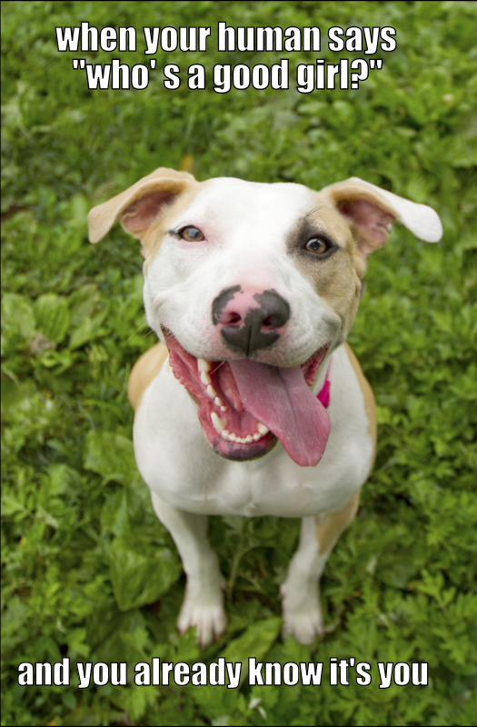
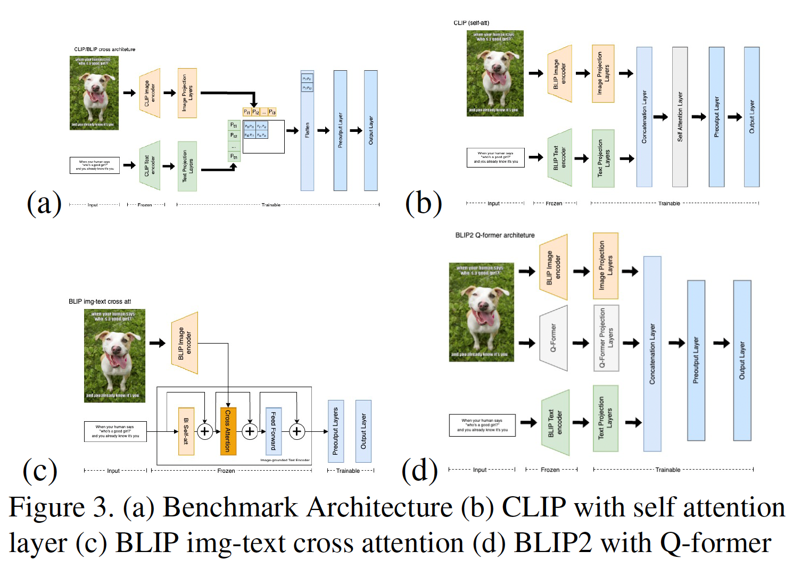
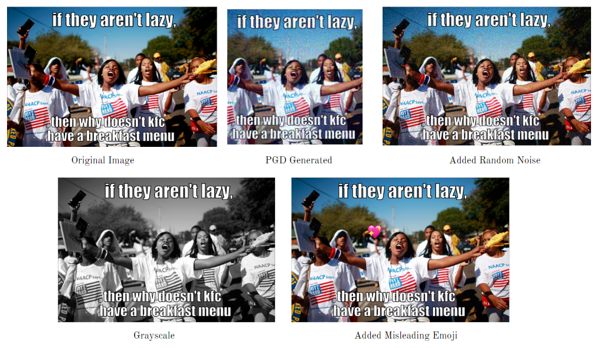

# Detecting Hateful Memes: An Exploration of Vision-Language Models & Adversarial Robustness
**Date Published:** May 11, 2025  
**Author:** Wei Hong Low  

**Tags:** Vision-Language Models, Hateful Memes, Adversarial Robustness, Deep Learning, CLIP, BLIP, BLIP-2  

**Estimated Reading Time:** 8 minutes  

---  

This project, undertaken as part of Georgia Tech's CS 7643 (Deep Learning), delves into the challenge of identifying hateful content within multimodal memes. We assessed the performance and robustness of newer transformer-based vision-language models on Facebook AI's Hateful Memes Challenge dataset.

**My Role:** Focused on the implementation and fine-tuning of BLIP and BLIP-2 architectures, including preparing the dataloader pipeline and comparing their performance against models like CLIP.

## 1. Introduction & Motivation

Memes are a powerful form of communication on social media, but they can also be vehicles for harmful and hateful content. While humans can often easily discern intent, AI models face significant hurdles due to the complex interplay of text and imagery, along with cultural and contextual nuances.

[The Hateful Memes Challenge by Facebook AI](https://ai.meta.com/blog/hateful-memes-challenge-and-data-set/) aims to benchmark models on this task. Our project was motivated by the shift in vision-language architectures towards more streamlined transformer-based models (like CLIP, BLIP, ViLT) that avoid computationally expensive object detection stages found in many earlier state-of-the-art approaches for this challenge. We aimed to explore these newer models, assess their baseline performance, and investigate their robustness.

*Figure 1: Example of a non-hateful meme from the Hateful Memes Challenge Dataset*

## 2. Approach

Our methodology involved several stages:

* **Model Selection:** We focused on three key vision-language models:
    * **CLIP (Contrastive Language-Image Pre-Training):** Known for its strong zero-shot capabilities and robust multimodal representations learned from diverse image-text pairs. 
    * **BLIP/BLIP-2 (Bootstrapping Language-Image Pre-training):** Leverages pre-training objectives like image-text contrastive loss, matching loss, and language modeling. BLIP-2 further utilizes frozen image encoders and LLMs. My primary focus was on implementing and evaluating these models.
    * **ViLT (Vision-and-Language Transformer):** Aims for efficiency by processing images as patches directly within a shared transformer encoder. 

* **Fine-tuning & Architectural Modifications:**
    * We fine-tuned these pre-trained models on the Hateful Memes Challenge dataset. 
    * We experimented with architectural modifications, particularly for CLIP and BLIP, such as adding classification layers and exploring different methods to combine image and text encodings (e.g., simple concatenation, batch matrix multiplication, self-attention).

    *Figure 3: Examples of model architectures explored. (a) Benchmark Hate-CLIPper, (c) BLIP with image-text cross-attention, (d) BLIP-2 with Q-former.*

    

* **Adversarial Robustness Evaluation:**
    * We assessed model resilience to adversarial attacks, which is crucial for real-world content filtering.
    * **Grey-box Attacks:** Used Projected Gradient Descent (PGD) on pre-trained CLIP to generate adversarial images.
    * **Black-box Attacks:** Employed simple data augmentation techniques on images (e.g., noise, greyscale) and text (e.g., typos, unicode character replacement) using Meta AI's AugLy library, and adversarial patching with emojis.
    * **Adversarial Training:** Retrained models on a dataset augmented with these adversarial examples to potentially improve robustness.

    *Figure 2: Examples of adversarial image transformations*

    

## 3. Key Findings & Results

* **Model Performance:**
    * CLIP generally outperformed BLIP and ViLT on the Hateful Memes Challenge dataset. This was attributed to CLIP's larger and more diverse training data and its tailored representations for multimodal classification.
    * Fine-tuning significantly improved performance over zero-shot capabilities. Our fine-tuned CLIP, even without extensive architectural changes, achieved competitive results (AUC 0.774, Acc 70.7% on test-unseen) compared to earlier benchmarks.
    * Architectural modifications, such as those inspired by Hate-CLIPper [6] and our explorations with different fusion methods (e.g., batch matrix multiplication for CLIP), showed promise in further boosting performance. Our best model, based on Hate-CLIPper, achieved an AUC of 0.824 and accuracy of 75.6% on the test-unseen set.

* **Adversarial Robustness:**
    * Models were vulnerable to adversarial attacks. Combined attacks on both image and text modalities were most effective in degrading performance (e.g., PGD + unicode replacement led to an 18.44% success rate and a 10.2% drop in AUC on the test-unseen set for the CLIP (Concat) model).
    * Image modality attacks (like PGD) were generally more impactful than text-based attacks.
    * Simple black-box attacks, like overlaying emojis, showed surprising effectiveness given their ease of implementation. 
    * Adversarial training proved beneficial, not only improving robustness (e.g., reducing combined attack success rates and mitigating AUC drops) but also slightly enhancing model performance on the original unseen datasets.

## 4. Challenges & Future Work

* **Hardware Limitations:** Access to powerful hardware for extensive model ensembling (a common technique among top challenge performers) was a constraint.
* **Computational Cost of Attacks:** Generating adversarial examples, especially with PGD, was computationally intensive, limiting the scope of models we could perform exhaustive adversarial evaluations on.
* **Future Directions:** Could include ensembling diverse modern vision-language architectures and conducting more model-specific robustness studies.

## 5. Conclusion

This project highlighted CLIP's strengths in multimodal meme classification and underscored the critical need to address adversarial vulnerabilities in such systems. Our experiments demonstrated that while newer transformer-based models offer streamlined alternatives, careful fine-tuning, architectural considerations, and adversarial training are essential for robust real-world deployment in tasks like hateful content detection. My work specifically on BLIP/BLIP-2 contributed to understanding their comparative performance and the nuances of their application in this challenging domain.
